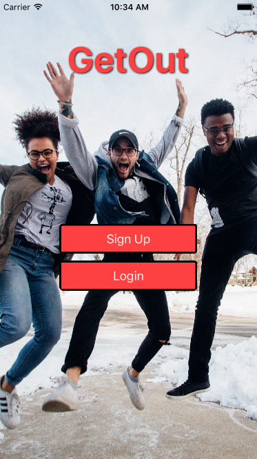
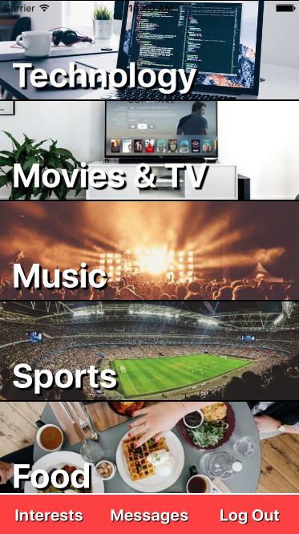
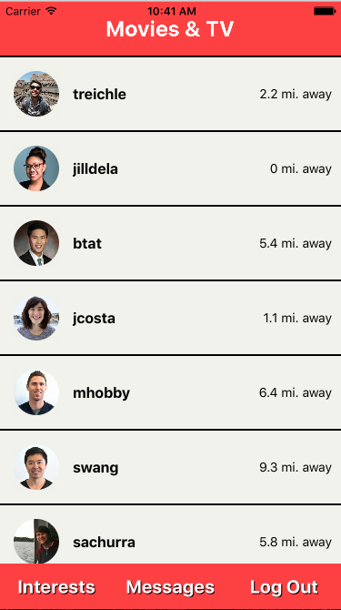
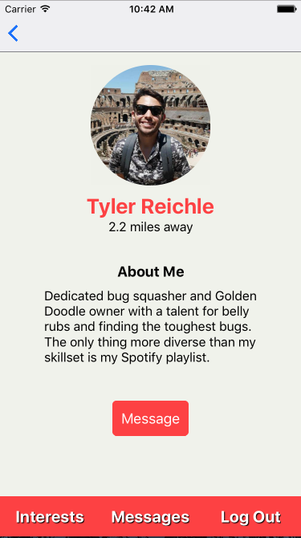
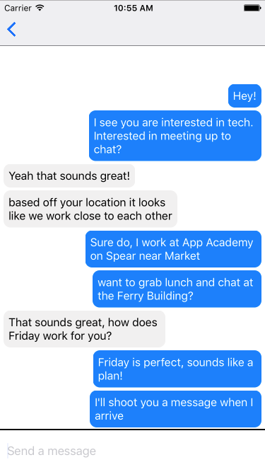

# GetOut

 Finding new people around you to discuss similar interests can be difficult. GetOut allows users to discover new places and new people with similar interests in their area. Users will be able to find people based on location, search by category, and schedule a meet up with chat functionality.

[GetOut](https://jetflex.github.io/AfternoonDelight/) is a collaborative project by [Tyler Reichle](https://github.com/tylerreichle), [Jill de los Angeles](https://github.com/jilldela), and [Eric Adams](https://github.com/eadams17).


## Features

- Create user accounts with secure authentication
- Find people around you with similar interests using geolocation
- Filter users by interests and conversational topics
- Chat with other users to schedule meetups

## Implementation

User's session tokens are stored in AsyncStorage allowing them to persist after app close. When returning to GetOut the session token is authenticated using a custom route then redirected to the home page. This takes advantage af ES7's new async and await functions.

```javascript
async verifyToken(token) {
  const sessionToken = token;

  try {
    const response = await fetch(`http://localhost:3000/api/verify?session%5Bsession_token%5D=${sessionToken}`);
    const res = await response.text();
    if (response.status >= 200 && response.status < 300) {
      const currentUserID = await AsyncStorage.getItem('id');
      Actions.CategoriesIndex(currentUserID);
    } else {
      const error = res;
      throw error;
    }
  } catch (error) {
    console.log(`Error: ${error}`);
  }
}
```




Cateogories are rendered using React Native's included classes TouchableHighlight and ListView, allowing the app to respond to user touch.

```javascript
<ListView
  enableEmptySections
  style={styles.categoriesList}
  dataSource={categories}
  renderRow={category => (
    <TouchableHighlight onPress={val => this.handlePress(val, category.id)}>
      <View style={styles.categoriesItem}>
        <Image source={{ uri: `${category.img_url}` }} style={styles.categoryPic}>
          <Text style={styles.categoryTitle}>{category.title}</Text>
        </Image>
      </View>
    </TouchableHighlight>
  )}
/>
```

While viewing all users interested in a selected category the currently sign in user is not shown among the results using filtering in the jBuilder response from Rails.

```ruby
json.users @category.users do |user|
  if current_user != user
    json.partial! 'api/users/user', user: user
  end
end
```



Real time updates while chatting accomplished with the Pusher gem and pusher-js package. When a chat component mounts it begins listenening for a new message event through a dedicated websocket port.

When a message is sent and saved into the database Rails will use Pusher to trigger a new message event notifying the chat component to request new messages from the backend.

```ruby
def create
  @message = Message.new(message_params)
  @message.user_id = current_user.id

  if @message.save
    render 'api/messages/show'
    # broadcast message after save to DB
    Pusher.trigger('chats', 'new-message', {
      message: @message.body
    })
  end
end
```

```javascript
export default class ChatroomShow extends React.Component {
  constructor(props) {
    super(props);

    this.pusher = new Pusher('a82f64a23895b9cddd1a', {
      cluster: 'us2',
      encrypted: true,
    });

    this.chatroom = this.pusher.subscribe('chats');
  }

  componentDidMount() {
    const self = this;
    this.chatroom.bind('new-message', function (data) {
      self.props.fetchMessages(self.props.data);
    });
  }
```



## Technology

### Frontend

GetOut follows the Redux implementation of the Flux design pattern, using a single store to manage the state of the application and enforce an unidirectional data flow. React Native is used to render React components in a mobile application. Components throughout the app are styled using React Native's integrated stylesheet system with pure JavaScript.

We used npm to manage all of the JavaScript packages, and the Babel transpiler to convert ES6 to ES5 and bundle it into a single file.

### Backend

We used Ruby on Rails to handle our backend and RESTful API requests along with PostgreSQL running the database.

## Future Implementaion

- Additional secure login options with OAuth and Faceboook/Google logins
- Add search functionality for users and categories
- Google Maps integration allowing users to receive directions to meet up
- Yelp API integration used to offer meeting place suggestions
